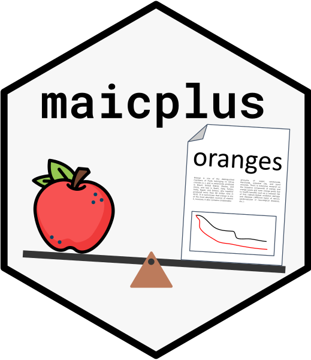

# maicplus <a href="https://hta-pharma.github.io/maicplus"></a>

## Overview

The maicplus package provides tools to perform matching-adjusted indirect comparison (MAIC) analysis. MAIC is a method used to adjust for differences in baseline characteristics between treatment groups in indirect comparisons, typically where patient-level data are available for one treatment but only aggregate-level data are available for the comparator treatment.

## Features

- Perform both MAIC analysis for time-to-event endpoints (e.g. overall survival).

- Perform MAIC analysis for binary endpoints (e.g. objective tumor response).

- User-friendly functions to facilitate the analysis process.

- Comprehensive documentation and examples to guide users through the analysis.

## Installation

You can install the latest version of `maicplus` on CRAN with:

```r
install.packages('maicplus')
```

or you can install the development version with:

```r
remotes::install_github("hta-pharma/maicplus")
```

## Tutorial

To learn how to use the `maicplus` R package, refer to the [package website (hta-pharma.github.io/maicplus/)](hta-pharma.github.io/maicplus/).

## Bibliography

Chen G, Seo M, Antoniou M, Belleli R, Kalyvas C, Gravestock I. SA83 {Maicplus}: An R Package to Support Analysis and Reporting of Matching Adjusted Indirect Treatment Comparisons (MAIC) for HTA Dossiers. Value in Health. 2023;26(12):S558. doi:10.1016/j.jval.2023.09.2992

Phillippo D, Ades T, Dias S, Palmer S, Abrams KR, Welton N. NICE DSU Technical Support Document 18: Methods for Population-Adjusted Indirect Comparisons in Submissions to NICE. Vol 18. NICE Decision Support Unit; 2016.
